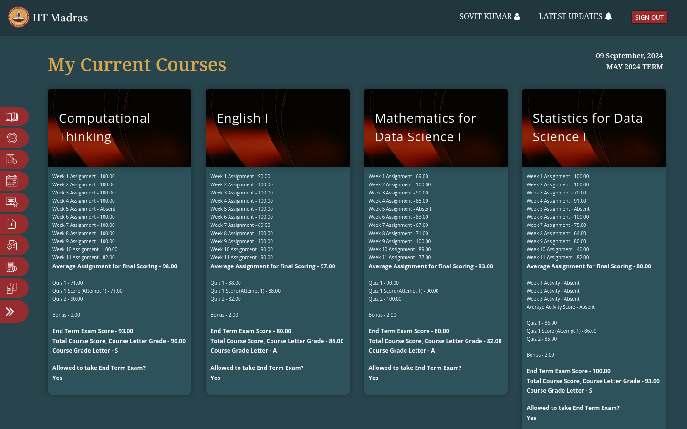
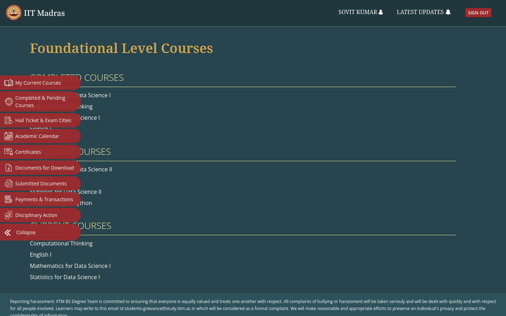
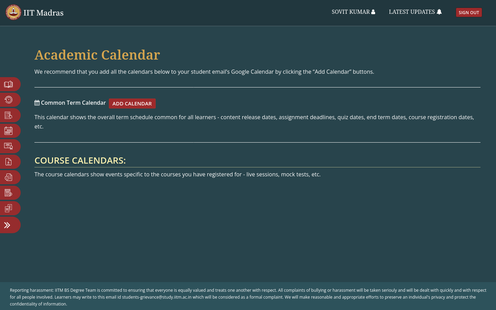
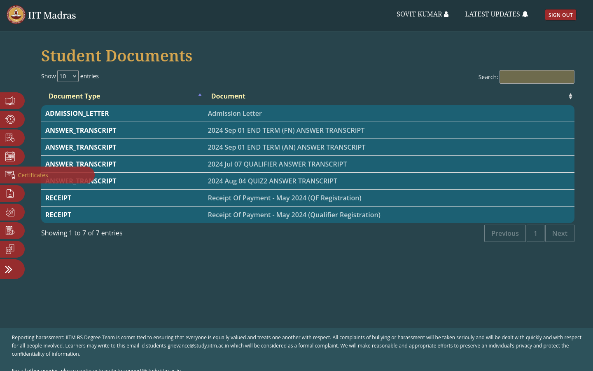

# Blue Theme for IITM BS Students' Dashboard

This project provides a clean, modern, and visually appealing Blue Theme for the IITM BS Students' dashboard, enhancing the user experience with a sleek, updated design.
## How to Install

Follow these steps to apply the Blue Theme to your dashboard:

### Step 1: Install the Stylus Extension
The Stylus extension is required to apply the theme. Choose the version for your browser:

* **For Firefox:** [Firefox Add-On](https://addons.mozilla.org/firefox/addon/styl-us/)
* **For Chrome, Brave, Edge, etc.:** [Chrome Extension](https://chrome.google.com/webstore/detail/stylus/clngdbkpkpeebahjckkjfobafhncgmne)

### Step 2: Apply the Theme
Once Stylus is installed, simply click the link below to install the theme:

[Install Blue Theme](https://github.com/5ovit/iitm_bs_dashboard_blue/raw/main/iitm_bs_dashboard_blue.user.css)

## Screenshots

Below are a few screenshots showcasing the Blue Theme applied to various pages of the IITM BS Dashboard:

    
    
    
    

## Features

- Modern Blue color scheme
- Improved readability and navigation
- Sleek, minimalist design

## Contributing

If you have suggestions, ideas, or issues, feel free to open an issue or submit a pull request on [GitHub](https://github.com/5ovit/iitm_bs_dashboard_blue).
