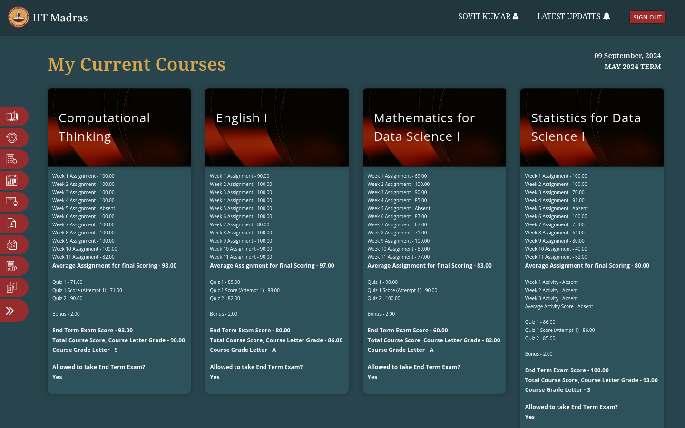
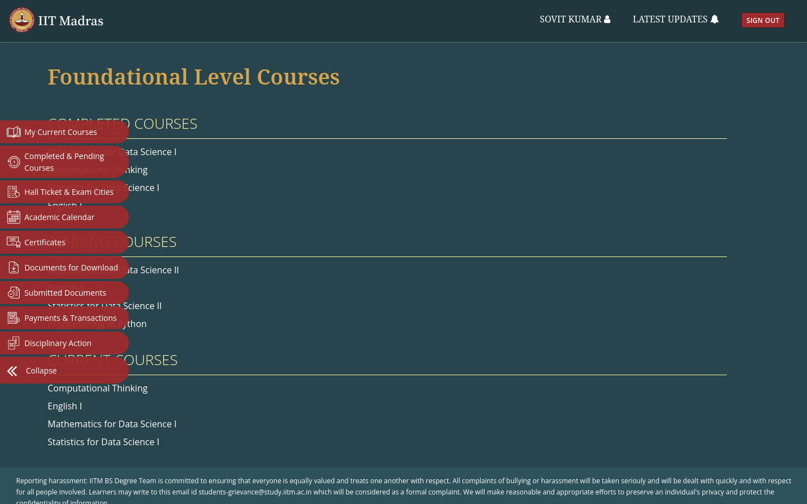
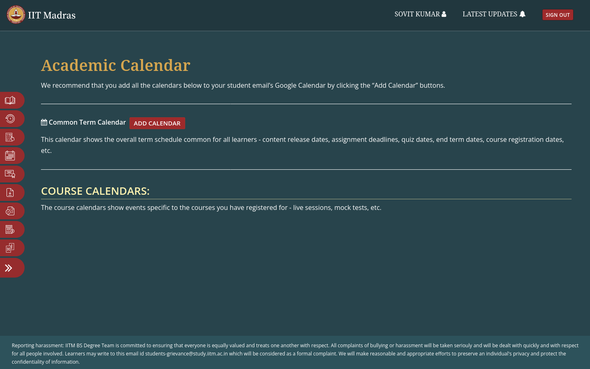
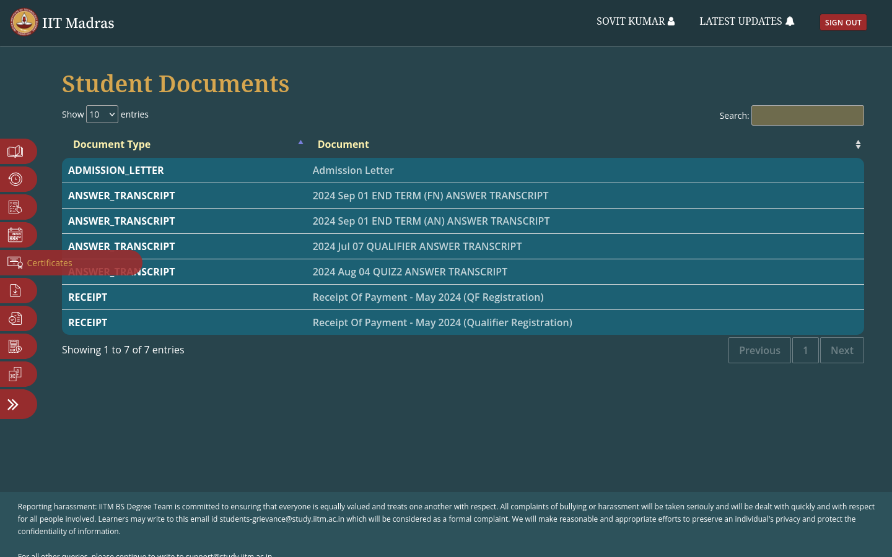

# Blue Theme for IITM BS Students' Dashboard
  
This project is for getting out the matrix of old boring style into
a newly fresh Blue Theme as you can see in the Screenshots below.  

## Screenshots

## Question: How to Install it?

### First you need to install an extension named `Stylus`
My theme is injected into the dashboard using this Extension. Also for it's easier to update the using this extension.  
You can this using the links below
* For Firefox: [Firefox AddOn](https://addons.mozilla.org/firefox/addon/styl-us/)
* For Chrome, Brave, Edge etc..: [Chrome Extension](https://chrome.google.com/webstore/detail/stylus/clngdbkpkpeebahjckkjfobafhncgmne)

### Now you can simple click on [Install](https://github.com/5ovit/iitm_bs_dashboard_blue/raw/main/iitm_bs_dashboard_blue.user.css) to install the theme
